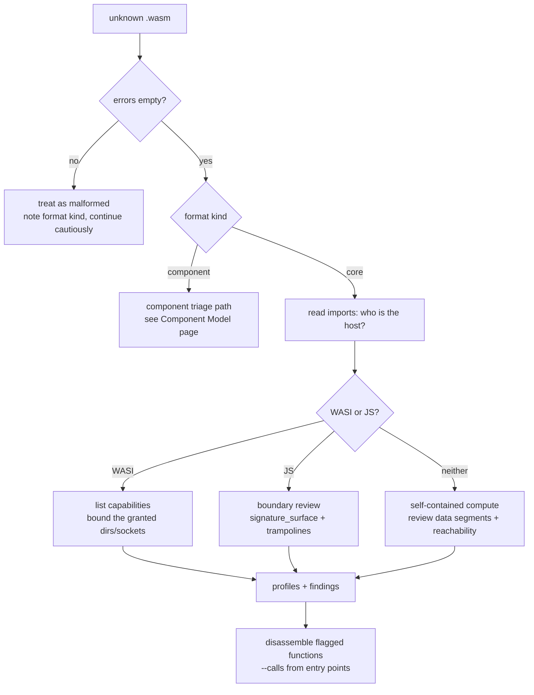

# Analyst guide

This guide is written for the moment you have an unknown `.wasm` file and a deadline. It gives you a triage order, the decisions to make at each step, and the recipes to execute them. Field-level detail lives in the [JSON report reference](JSON_REFERENCE.md) and rule-level detail in [findings and signals](FINDINGS.md).

## The mental model

A WebAssembly module cannot do anything on its own. It computes over its own linear memory, and every interaction with the world is an imported function that the host must supply. So the two questions that drive all triage are:

1. What does this module ask its host for? The import section answers this.
2. What can be called into this module? The export section and the start function answer this.

Everything else, the call graph, strings, profiles, findings, is refinement of those two questions.



## The 60-second pass

```bash
wasm-tools sample.wasm --json --analysis-only | jq '{summary: .summary, format: .detections.format, wasi: .detections.wasi.detected, js: .detections.js_interface.detected, caps: .capabilities, findings: [.findings[].id]}'
```

One command, five decisions' worth of context. A typical high-surface WASI module reads:

```json
{
  "summary": { "risk_score": 70, "risk_tier": "high", "finding_count": 1 },
  "format": { "kind": "core", "confidence": "high" },
  "wasi": true,
  "js": false,
  "caps": ["crypto.random", "fs.io", "fs.path", "network", "process.terminate"],
  "findings": ["WASM-CAP-001"]
}
```

Interpretation: a core module asking the host for filesystem paths, file I/O, sockets, randomness, and process exit. That is the capability set of a networked command-line tool, which may be exactly what it is supposed to be, or exactly what it is not. You need one level deeper: which imports, and are they justified by what the vendor claims?

## Recipe: what host resources can this module reach?

```bash
wasm-tools sample.wasm --json | jq '.imports[] | select(.module | startswith("wasi")) | .name'
```

Read the names directly: `fd_write` and `path_open` mean file I/O, `sock_send` and `sock_accept` mean networking, `proc_exit` means it can terminate the host process, `random_get` means it draws randomness. Cross-check against the `capabilities` tokens, which are derived from the same imports with the mapping in [findings and signals](FINDINGS.md).

The security question is not whether the imports exist. It is whether the runtime grants them. A WASI module run under Wasmtime with explicit `--dir` grants only reaches what you mounted. The same module embedded in an over-permissive runner reaches everything it asks for. Your job is to compare the ask against the grant.

## Recipe: does this module talk to JavaScript?

```bash
wasm-tools sample.wasm --json | jq '.analysis.detections.js_interface | {detected, confidence, signals, builtin_sets, import_count, export_count}'
```

If `detected` is true, pull the three boundary signals in one shot:

```bash
wasm-tools sample.wasm --json | jq '{
  risky: .analysis.detections.js_interface.signature_surface.risks,
  conversion_ops: .analysis.profiles.control_flow.callsite_conversion_ops,
  trampolines: .analysis.detections.js_interface.entry_trampolines
}'
```

Read them as pressure indicators. `externref_i64_mix` means boundary signatures mix tagged references with 64-bit values, which is where return-value materialization bugs live. Non-zero `callsite_conversion_ops` means the code converts types near call sites; higher counts mean more glue. An `entry_trampolines` hit lists functions that act as glue and the risky ops they contain (`i32.wrap_i64`, `table.set`). When `WASM-JSCFG-006` also fires, JS-reachable code paths combine dynamic dispatch with mutable tables, and that combination earns a manual disassembly pass. [Lesson 4](LESSON4.md) works a real module end to end.

## Recipe: is this module obfuscated or adversarial?

No single field proves intent. Run down this list and let the pattern decide:

1. `errors` non-empty on a file that should be intact. Corruption happens, but deliberate malformation is also a choice.
2. Format kind is `possible-component` when you expected a core module, or `invalid-core` for anything.
3. All function names are empty and the toolchain block is empty. Stripped production builds look like this legitimately, but combined with point 4 it blinds static review.
4. High `indirect_call_ops` with stripped names and non-empty `table_mutation_ops`: dispatch through mutable tables is the WebAssembly idiom for hiding control flow from static readers.
5. A few functions with very large `body_size`: monolithic generated or transpiled code, common in obfuscation.
6. Data segments with high entropy: possible encrypted payloads. Pull the segment list and hexdump the interesting ones.
7. `WASM-LOOP-004` or `WASM-CFG-002` with no algorithmic justification.

Also consider the inverse: a module that is _too_ clean. Import lists copied from a known-good toolchain, tidy exports, and a single suspicious import buried at the end is a classic minimal-footprint pattern. Read the whole import list every time.

## Recipe: could this loop forever or exhaust memory?

```bash
wasm-tools sample.wasm --json | jq '.analysis.profiles.compute, .analysis.profiles.memory, .analysis.findings[] | select(.id? == "WASM-DOS-003")'
```

`WASM-DOS-003` fires when memory growth happens in loop context. `WASM-LOOP-004` fires at loop depth 3 or more. Both are amplification patterns: a small export doing unbounded work. The remediation is runtime-side (fuel limits, memory caps, watchdogs) plus a look at whether the exported functions that reach those loops validate their inputs.

## Recipe: what does this module expose to its host?

```bash
wasm-tools sample.wasm --json | jq '.exports'
```

Three patterns deserve attention. An exported `memory` gives the host full read and write access to the module's address space; normal for Emscripten and wasm-bindgen, still a boundary to record. An exported `_start` or `__wbindgen_start` means initialization code runs at instantiation, before anyone calls anything; know what it does. And any export whose name sounds like an interface to sensitive operations (`execute`, `eval`, `run_script`, `deploy`) deserves a `--calls` pass to see what it reaches.

## Recipe: what is in the data?

```bash
wasm-tools sample.wasm --strings
wasm-tools sample.wasm --json | jq '.analysis.detections.strings'
```

Strings come out with their segment and linear-memory provenance, so you can hexdump around them to see what they are packed with. The screening block reports secret and indicator signals with masked samples; full values are in `strings[]`. A URL alone is weak evidence (license text and docs links are everywhere), but an AWS key shape, a PEM header, a JWT, or a stratum mining endpoint is not. Severity in `WASM-STR-007` reflects exactly that split. [Lesson 5](LESSON5.md) works a fixture with all of them.

## Reading the disassembly without drowning

Full-body dumps are for the functions you have already flagged. Use the call graph to spend attention well:

```bash
wasm-tools sample.wasm --json | jq '.call_graph.reachability'
wasm-tools sample.wasm --calls run
```

`reachability.unreachable_functions` is dead code; skip it. Start call trees at exported functions and walk outward. For each flagged function, read the `-d` output for: calls into `wasi_snapshot_preview1` or `wbg`/`js` (what it does to the host), `memory.grow` and bulk ops inside loops (exhaustion), and `call_indirect` whose table indices are mutated nearby (dynamic control flow).

## Index-space traps

Two mistakes account for most misreadings. First, function indices are global: with two imports, `func[2]` is the first local body, and `call 0` inside a body calls the first import, not the first function. Second, section detail headers count entries, not indices: `Function[3]` means three function-section entries. When in doubt, cross-reference `imports[]` and `functions[]` in JSON, which use the same global spaces.

## What this tool cannot tell you

The decoder does not validate type checking, does not execute, and does not resolve runtime dispatch. An indirect call edge marked `indirect-approx` may never fire at runtime. A risk score of 0 says nothing about what the code computes; a self-contained module implementing an attack primitive scores zero because it needs nothing from the host. Treat every number here as a pointer to a location you still need to read.
