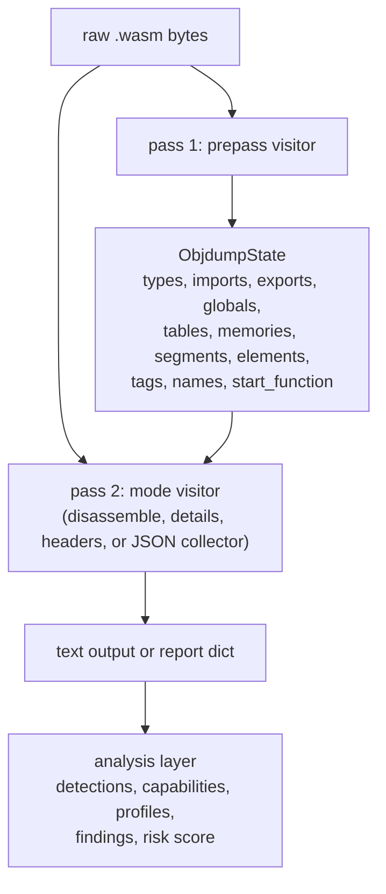
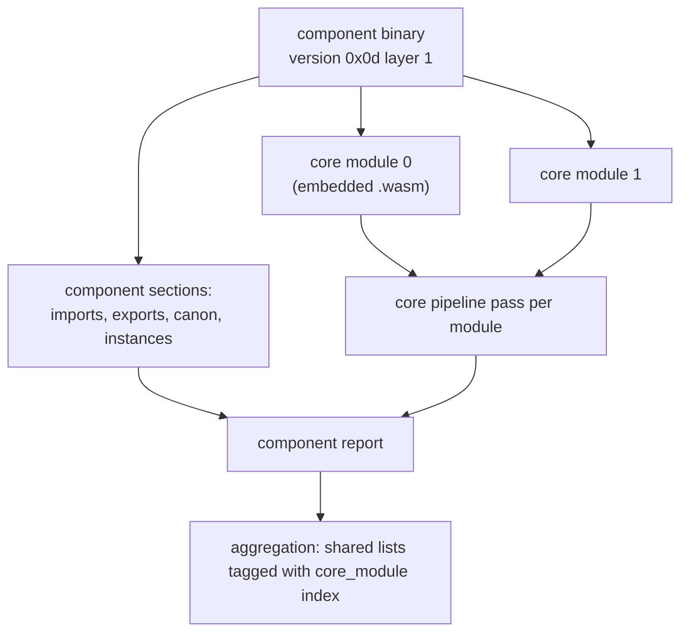

# Architecture

This page describes how wasm-tools decodes WebAssembly binaries and why it is built the way it is. It is aimed at contributors and at anyone who wants to trust the tool enough to build on it. The binary format itself is covered in the [format primer](FORMAT_PRIMER.md).

## One paragraph summary

`BinaryReader` in `wasm_tools/parser.py` owns the byte walk and raises nothing at callers: parse failures go to a delegate callback. Delegates in `wasm_tools/visitor.py` turn decode events into output: text modes for the CLI and a JSON collector for the API. Every CLI and API entry point runs the parse twice over the same buffer, once to collect names and types into shared `ObjdumpState`, once to produce output using that state. The analysis layer in `wasm_tools/api.py` is pure post-processing over the decoded data.

## Module map

| File                      | Responsibility                                                                                                                     |
| ------------------------- | ---------------------------------------------------------------------------------------------------------------------------------- |
| `wasm_tools/parser.py`    | `BinaryReader`: section framing, LEB decoding, instruction decoding, section decode methods. The only code that touches raw bytes. |
| `wasm_tools/opcodes.py`   | `OPCODES` table mapping `(prefix, opcode)` to `(mnemonic, ImmType)`, plus the `ImmType` enum.                                      |
| `wasm_tools/visitor.py`   | Prepass, headers, details, and disassemble visitors built on a no-op base.                                                         |
| `wasm_tools/models.py`    | `ObjdumpMode`, `ObjdumpOptions`, `ObjdumpState`: the shared state contract between passes.                                         |
| `wasm_tools/api.py`       | Public functions, the JSON collector, and the analysis layer (detections, capabilities, profiles, findings, risk score).           |
| `wasm_tools/component.py` | Component preamble detection and component-section parsing; nested core modules are re-entered through the same core parser.       |
| `wasm_tools/strings.py`   | String extraction from data segments and secret/IoC screening. Pure post-processing.                                               |
| `wasm_tools/graph.py`     | Call graph, import xrefs, and reachability. Pure post-processing.                                                                  |
| `wasm_tools/cli.py`       | Argument parsing, mode selection, text rendering for strings and call trees.                                                       |

## The two-pass pipeline

Both passes walk the same byte buffer with independent `BinaryReader` instances sharing one `ObjdumpState`. The prepass runs first because the `name` custom section appears after the code section in binary order; a single-pass disassembler would print bodies before it knows their names.



In code, a call to `parse_wasm_file("module.wasm")` proceeds:

```text
parse_wasm_file("module.wasm")
  |
  +-- read bytes
  |
  +-- pass 1: BinaryReader(data, BinaryReaderObjdumpPrepass)
  |     begin_module(version)
  |     for each section:
  |       read id (u8), size (leb128u), payload
  |       _decode_type()      -> on_type(i, params, results)
  |       _decode_import()    -> on_import(i, mod, name, kind, ...)
  |       _decode_function()  -> on_function(i, sig_idx)
  |       _decode_custom()    -> on_function_name / on_local_name
  |       ...
  |
  +-- pass 2: BinaryReader(data, _BinaryReaderJsonCollector)
  |     same walk, now with names available from state
  |     _decode_code()
  |       begin_function_body(i, size)
  |       read_instructions(end)   # opcode -> immediate callbacks
  |       end_function_body(i)
  |
  +-- collector.build_report() -> dict
  +-- strings extraction, call graph, analysis layer
```

## The delegate contract

The parser never decides what decoded data means. It calls methods on a delegate, checking presence first so minimal delegates are valid:

```python
if hasattr(self.delegate, "on_function"):
    self.delegate.on_function(i, sig_idx)
```

A delegate that implements only `begin_module`, `begin_section`, and `begin_custom_section` drives a full parse. A visitor that cares about instructions implements `begin_function_body`, `on_opcode`, and the immediate callbacks it uses. Missing callbacks are skipped, never an error.

The important callbacks, grouped:

```text
lifecycle:   begin_module(version)              begin_section(index, code, size)
             begin_custom_section(index, size, name)        on_error(message)

entities:    on_type(index, params, results)    on_import(index, module, name, kind, ...)
             on_function(index, sig_index)      on_table(index, ref_type, min, max, is_64,
                         shared=False, page_size_log2=None)
             on_memory(...)                     on_global(index, valtype, mutable, init_expr)
             on_export(index, name, kind, ref_index)
             on_start(func_index)               on_tag(index, type_index)
             on_element(index, mode, ref_type, table_idx, offset_expr, count, func_indices)
             on_data(index, mode, mem_idx, offset_expr, size, data_bytes, offset_value=None)
             on_data_count(count)

code:        begin_function_body(index, size)   end_function_body(index)
             on_local_decl(func_index, decl_index, count, valtype)
             on_opcode(opcode)                  on_opcode_bare()
             on_end_expr()                      on_opcode_index(idx)
             on_opcode_block_sig(sig)           on_opcode_uint32(val) / uint64 / f32 / f64
             on_opcode_uint32_uint32(v1, v2)    on_call_indirect_expr(sig, table)
             on_opcode_heap_type(ht)            on_opcode_lane_idx(lane)
             on_opcode_memarg_lane(a, o, lane)  on_opcode_v128(raw) / v128_shuffle(lanes)
             on_opcode_br_table(targets, default)
             on_opcode_br_on_cast(flags, label, ht1, ht2)
             on_opcode_try_table(sig, catches)  on_opcode_select_t(types)

names:       on_function_name(idx, name)        on_local_name(fidx, lidx, name)
```

Index semantics follow the binary: `begin_section` receives encounter order, while entity callbacks use module-global index spaces where imported entities occupy the low indices. Consumers comparing against `wasm-objdump` should rely on this.

## Instruction decoding

`read_instructions()` is the heart of pass 2. It looks up `(prefix, opcode)` in `OPCODES`, gets a `(mnemonic, ImmType)` pair, and switches on the immediate type to consume exactly the right bytes:

```text
opcode byte(s)            ImmType          parser reads
0x10 (call)               INDEX            one u32 LEB
0x02 (block)              BLOCK_SIG        one s32 LEB
0x28 (i32.load)           MEMARG           align u32, offset u32
0x41 (i32.const)          I32              signed LEB
0x43 (f32.const)          F32              4 raw IEEE 754 bytes
0x0E (br_table)           BR_TABLE         count u32, count labels, default u32
0x25 (call_indirect)      CALL_INDIRECT    type u32, table u32
0xFC 8 (memory.init)      MEMORY_INIT      data seg u32, memory u32
0xFD 12 (v128.const)      V128_CONST       16 raw bytes
0x1F (try_table)          TRY_TABLE_BLOCK  sig s32, count u32, catch clauses
```

Depth tracking closes each body: `block`, `loop`, `if`, `try_table` increment, `end` decrements, depth zero ends the body. The code entry's declared body size is the hard bound.

Unknown opcodes decode as `unknown_<prefix>_<opcode>` with `ImmType.NONE`. The loop keeps going. This is a deliberate trade: an unknown instruction with unrecognized immediates can desync the immediate scan, but aborting the whole analysis on the first new opcode would make the tool useless against current toolchains. The desync risk is contained by the body-size bound and surfaced to callers through `unknown_opcodes` telemetry and `decode_incomplete` flags.

## Error model

`read_module()` wraps the parse in a try/except for `WasmParseError` and forwards the message to `delegate.on_error(...)`. Nothing re-raises. For the CLI this means clean error lines; for library callers it means `report["errors"]` entries; for batch pipelines it means one fuzzed file does not stop the run.

Two structural details make partial parses useful. When a section decode fails internally, the cursor is repositioned to the recorded section end, so later sections still decode. And every read is bounds-checked against the enclosing section, so a bad payload cannot read into the next section's bytes. `read_leb128()` enforces a maximum bit width per integer type, which bounds the damage of crafted continuation-byte runs.

Tested failure cases include truncated modules, bad magic, sections extending past file end, malformed LEB128, and truncated immediates.

## Security posture of the tool itself

The library performs no JIT, no evaluation, and no host callbacks. Parsing is allocation and arithmetic over a bytes buffer; the only side effects are the output the caller asks for. Combined with the error model, this is what makes it acceptable to point at hostile binaries: the worst outcome is a report full of errors. The analysis layer is pure post-processing over already-decoded dictionaries and cannot reach back into parsing.

Trust boundaries are explicit. Strings screening masks credential-shaped samples before they enter findings evidence, so reports and logs do not carry live secrets. The call graph's approximate edges are labeled as approximations rather than silently presented as fact. Risk scores are bounded and documented with their weights.

## Component Model handling

`detect_component()` reads the preamble: version byte `0x0d` or later with layer 1 marks a component. Component binaries do not contain code at the top level; they declare interfaces, canonical function lifts and lowers, and nested core modules. `wasm_tools/component.py` parses the component sections and re-enters the same core pipeline for each embedded module via an injected `core_parse` callable. The API aggregates the nested reports and tags shared-list entries with a `core_module` index. Details: [Component Model](COMPONENT_MODEL.md).



## Post-processing layers

Strings, call graph, and analysis never touch bytes. They consume the decoded dictionaries, which has three consequences. They cannot corrupt parsing, they can be skipped independently (`include_strings=False`, `include_call_graph=False`), and their heuristics can be tuned without re-validating the decoder. The analysis layer's rules and thresholds are documented with their exact behavior in [findings and signals](FINDINGS.md) precisely because they are heuristics presented to humans.

## Extending

The [development guide](DEVELOPMENT.md) walks the common extensions: adding opcodes, adding section decoders, writing custom visitors, and adding analysis rules with tests. The short version for opcodes: add the `(prefix, opcode)` entry to `OPCODES`, add an `ImmType` dispatch branch in `read_instructions()` if the immediate shape is new, render it in the visitors that need it, and test from a synthetic byte sequence.
