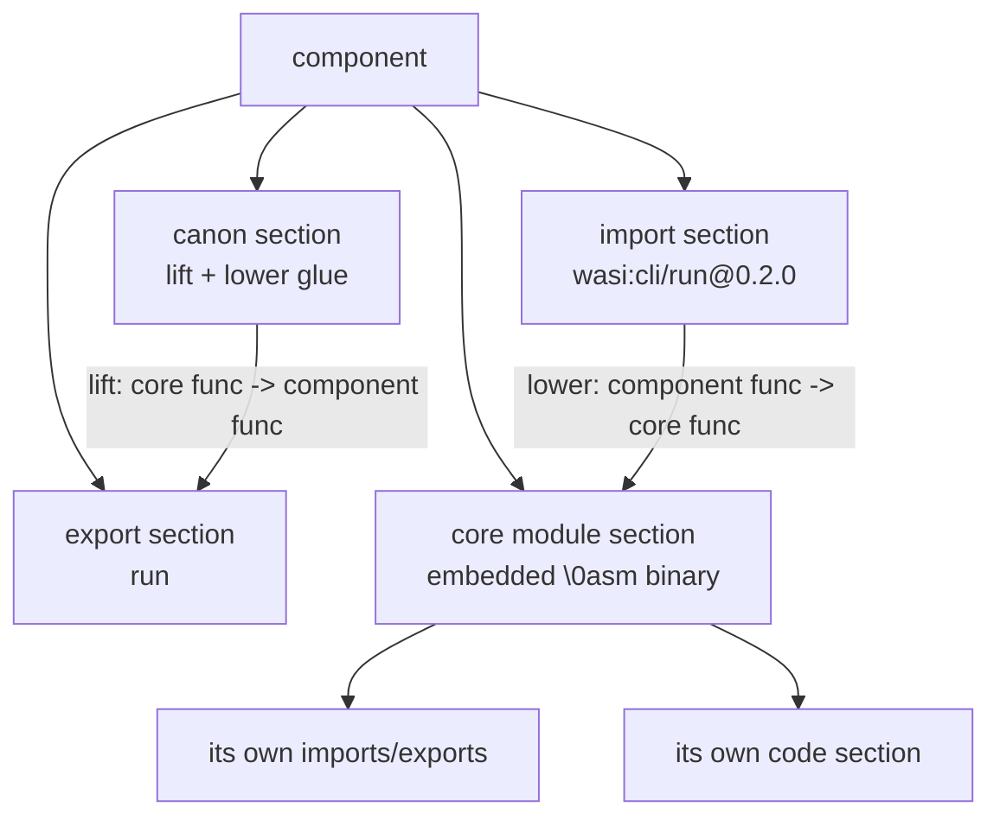

# Component Model

The Component Model is the second generation of WebAssembly packaging: instead of one monolithic module, a component bundles interface definitions, canonical glue, and one or more embedded core modules. This page explains what that means for analysis and how wasm-tools represents it.

## How to recognize a component

The file header is the giveaway. Core modules start with `\0asm` followed by version `01 00 00 00`. Components start with the same magic but a version byte of `0x0d` (13) or later and a layer byte:

```text
core module:   00 61 73 6D  01 00 00 00
component:     00 61 73 6D  0D 00 01 00
                            ^^    ^^
                            v13   layer 1
```

wasm-tools detects this automatically (`detect_component` in `wasm_tools/component.py`). The JSON report sets `is_component: true`, `module_version` carries the raw 32-bit header value (65549 for version 13), and `detections.format.kind` becomes `component`. No special flags are needed; the same CLI commands and library functions handle both shapes.

## What is inside

A component contains no executable code of its own. Its sections declare the component's surface and wire up embedded core modules:



Imports and exports use interface-qualified names such as `wasi:cli/run@0.2.0`, and canon sections declare the adapters between the component's typed world and the core modules' plain functions. Lifts turn core functions into component functions (this is where memory allocation and string encoding options appear), and lowers do the reverse.

## What the tool reports

Run the usual commands. For a small component wrapping a core module, `-x` prints a component summary:

```text
Component Details:

 component version: 13 layer: 1
 core modules: 1
 interfaces:
  - wasi:cli/run@0.2.0
 imports:
  - func type=0 <"wasi:cli/run@0.2.0">
 exports:
  - func[0] -> "run"
 canon: lift=1 lower=0 options: async

 core module[0]: version=1 functions=1 imports=0 exports=1
```

`-d` disassembles each nested core module in turn under a `Code Disassembly (core module[N])` heading. The JSON report gains a `component` block:

| Field                                | Meaning                                                                                                |
| ------------------------------------ | ------------------------------------------------------------------------------------------------------ |
| `component_version`, `layer_version` | From the preamble.                                                                                     |
| `imports`, `exports`                 | Component-level interface entries with kinds and type indices.                                         |
| `interfaces`                         | Interface-qualified names, including package versions.                                                 |
| `interface_packages`                 | Package names referenced by interfaces.                                                                |
| `canonical_options`                  | Lift and lower counts plus the option set (for example `async`, `memory`, `realloc`, string encoding). |
| `core_modules`                       | Fully decoded reports for each embedded core module, same shape as a standalone report.                |

Because consumers often want one flat view, the shared top-level lists (`sections`, `imports`, `functions`, `strings`, and others) are aggregations across all nested core modules, and every aggregated entry carries a `core_module` index. When indices collide across modules (function index 0 in two modules is two different functions), the `core_module` field disambiguates.

## Triage differences

WASI detection works the same way but reads interface names: `wasi:*@0.2.x` interfaces produce the `preview2` variant, `@0.3.x` and later produce `preview3`. Capability inference applies the same name-based mapping to interface names, so `wasi:filesystem/preopens@0.2.0` yields `fs.path`. The JS interface detection reads component import and export names for `wasm:*` builtins and glue patterns.

The call graph is computed per core module, since function index spaces are per module. Indirect and typed call edges remain over-approximations, and cross-module edges through canon adapters are not reconstructed; treat each core module's graph as its own island.

```text
triage order for components
1. interfaces + canonical_options   who is the component for the host?
2. per core module: imports          what does each module ask for?
3. aggregated strings                what data rides along?
4. per core module findings          one pass of the standard recipes
```

## Building a test component

There is no component fixture in the test suite, but you can synthesize one with a few lines of Python. This snippet wraps `tests/fixtures/simple_add.wasm` as the core module of a component with one import, one export, and one canon lift:

```python
from wasm_tools.api import parse_wasm_bytes

def leb(n):
    out = bytearray()
    while True:
        b = n & 0x7F
        n >>= 7
        if n:
            out.append(b | 0x80)
        else:
            out.append(b)
            return bytes(out)

def name(s):
    raw = s.encode()
    return leb(len(raw)) + raw

def section(sid, payload):
    return bytes([sid]) + leb(len(payload)) + payload

core = open("tests/fixtures/simple_add.wasm", "rb").read()
imports = section(10, leb(1) + b"\x00" + name("wasi:cli/run@0.2.0") + b"\x01" + leb(0))
core_module = section(1, core)
canon = section(8, leb(1) + b"\x00\x00" + leb(0) + leb(1) + b"\x06" + leb(0))
exports = section(11, leb(1) + b"\x00" + name("run") + b"\x01" + leb(0) + b"\x00")
component = b"\x00asm\x0d\x00\x01\x00" + imports + core_module + canon + exports

report = parse_wasm_bytes(component, filename="sample.component.wasm")
print(report["component"]["interfaces"])
print(report["analysis"]["detections"]["wasi"]["variants"])
```

The `variants` output should print `["preview2"]`, and the core module's single `add` function appears under `component.core_modules[0]`. The same file works with the CLI: write it to disk and run `wasm-tools sample.component.wasm -x`.

## Known limits

Component parsing covers the interface surface: preamble detection, import, export, canon, instance, and type sections, plus full decode of nested core modules. It does not reconstruct cross-module call edges, does not decode every exotic type grammar in component type sections, and per-core-module index spaces mean shared-list indices repeat across modules. These limits are recorded in the [coverage matrix](COVERAGE.md).
