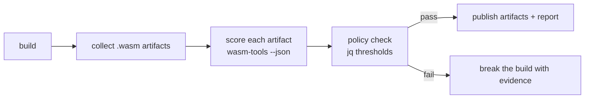

# Lesson 10: Automated triage in CI

Manual triage does not scale and does not need to. The JSON report is designed to be a build artifact, and the analysis layer is designed to be policy-checked. This lesson assembles both into a CI gate: every build that contains a `.wasm` artifact gets scored, and the gate fails when the score or specific findings cross your threshold.

## The shape of a gate

A WebAssembly gate has four stages:



Keep the scanner and the policy separate. The scanner answers "what is in this binary"; the policy answers "what do we allow". That separation lets you tune policy without re-running anything, and it keeps the evidence (the full JSON report) attached to the build.

## Scanning step

The tool reads one file per invocation and never fails on bad input, which makes a shell loop the simplest scanner:

```bash
mkdir -p wasm-reports
status=0
for wasm in $(find dist -name '*.wasm'); do
  name=$(basename "$wasm" .wasm)
  wasm-tools "$wasm" --json --json-out "wasm-reports/$name.json" || status=1
done
exit $status
```

For trees with many artifacts, the Python scanner from [lesson 9](LESSON9.md) is faster (one process) and yields one JSON line per file, which is friendlier for downstream aggregation. Two tuning flags matter at CI scale: `--no-strings` and `--no-call-graph` skip the derived blocks when your policy only needs the analysis layer, cutting work on large modules.

Commit or upload the `wasm-reports/` directory as the evidence trail. When a gate fails, the report attached to the failed run is what an analyst works from.

## Policy step

The policy operates on the scanner's summary lines (one JSON object per file, as produced in [lesson 9](LESSON9.md)). Three thresholds cover most needs: parse errors, unknown-opcode telemetry, and finding ids. Keep the logic in the shell and let jq answer one boolean per file, so exit codes stay honest:

```bash
rc=0
while IFS= read -r line; do
  file=$(jq -r .file <<<"$line")
  verdict=$(jq -r '
    if .errors > 0 then "parse errors present"
    elif .unknown_opcodes > 0 then "unknown opcodes: re-check toolchain coverage"
    elif .tier == "high" then "risk tier high"
    elif ([.findings[] | select(. == "WASM-CAP-001" or . == "WASM-JSCFG-006")] | length) > 0
      then "blocking finding present"
    else "ok" end' <<<"$line")
  printf '%s: %s\n' "$file" "$verdict"
  [ "$verdict" = "ok" ] || rc=1
done < summary-lines.jsonl
exit $rc
```

Real gates will differ; the point is the vocabulary. `WASM-CAP-001` (filesystem plus network) and `WASM-JSCFG-006` (JS-facing dynamic dispatch with mutable tables) are the two findings with the highest historical signal-to-noise in supply-chain review. Severity is already baked into each finding, so a simple "no high-severity findings" rule is a fine starting policy, and it fits in one command per report:

```bash
wasm-tools module.wasm --json --analysis-only \
  | jq -e '[.findings[] | select(.severity == "high")] | length == 0'
```

Exit code 0 passes, 1 fails, and the CI step fails with it.

## What to gate on, and what not to

Thresholds worth gating, roughly in order of value:

1. High-severity findings that match your threat model (credential strings in a public artifact, filesystem plus network in a browser module).
2. Format surprises: `possible-component` or `invalid-core` where you expected a core module, which is how a swapped or corrupted artifact surfaces.
3. New unknown opcodes relative to the previous build, which usually means the toolchain changed.
4. Risk tier as a trend, not a wall: alert when it rises between builds.

Avoid gating on raw profile counters. `memory_grow_ops` and loop depth are legitimate in compression and crypto code, and a hard ban will train your developers to ignore the gate. The finding rules already encode the compound conditions; prefer them over single counters.

## Baseline deltas

The most useful gate compares against the previous build rather than absolute thresholds. Keep the last accepted summary lines and diff scores with `--slurpfile`:

```bash
jq -n --slurpfile old old-summaries.jsonl --slurpfile new new-summaries.jsonl '
  ($old | map({key: .file, value: .score}) | from_entries) as $prev
  | [ $new[] as $row
      | select($prev[$row.file] != null and ($prev[$row.file] | tonumber) < $row.score) ]
  | length'
```

A non-zero result lists how many unchanged modules got riskier; swap `length` for the surrounding bracket to see the rows. A rising score on an unchanged module is the single best early-warning signal in this space: someone changed the imports, the data segments, or the control flow, and the score noticed before a human did.

## A minimal GitHub Actions job

```yaml
name: wasm-triage
on: [push]
permissions:
  contents: read
jobs:
  triage:
    runs-on: ubuntu-latest
    steps:
      - uses: actions/checkout@v4
      - run: pip install wasm-tools
      - run: |
          mkdir -p wasm-reports
          for wasm in $(find . -name '*.wasm' -not -path './tests/*'); do
            n=$(basename "$wasm" .wasm)
            wasm-tools "$wasm" --json --json-out "wasm-reports/$n.json"
          done
      - name: policy gate
        run: |
          fail=0
          for r in wasm-reports/*.json; do
            ok=$(jq '[.findings[]? | select(.severity == "high")] | length == 0' <(jq '.analysis' "$r"))
            echo "$r high_severity_absent=$ok"
            [ "$ok" = "true" ] || fail=1
          done
          exit $fail
      - uses: actions/upload-artifact@v4
        if: always()
        with:
          name: wasm-reports
          path: wasm-reports/
```

The upload runs `if: always()` so reports survive failed gates, which is the whole point of keeping evidence and verdict separate.

## Closing the loop

The gate's job is to move work from alerts to analysts: when it fails, the JSON report tells the analyst which functions, which imports, and which offsets to open, and [lessons 1](LESSON1.md) through [7](LESSON7.md) take over from there. The [SKILL.md](https://github.com/appthreat/wasm-tools/blob/main/SKILL.md) file in the repository summarizes the same loop for AI agents, if your pipeline has one.
