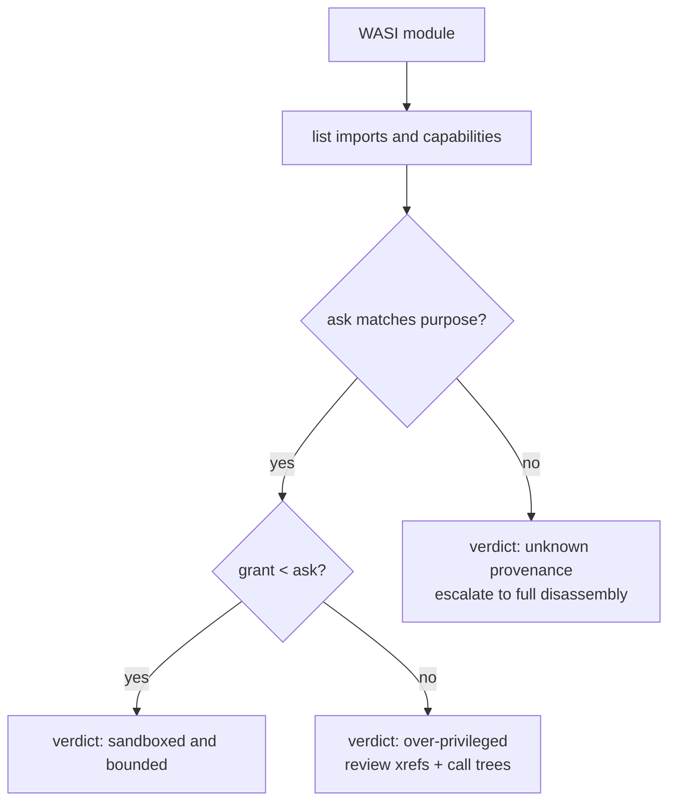

# Lesson 3: WASI triage

WASI is the WebAssembly System Interface: a standard set of host imports that turns a sandboxed module into a command-line-style program. WASI modules are everywhere right now, from plugin systems to serverless runtimes, which makes them the most common "real" triage target after browser modules. This lesson teaches you to read the WASI surface of a binary and decide what it could do if the runtime granted everything it asked for.

## The sample

`tests/fixtures/wasi_capabilities.wasm` is a small module with five preview1 imports:

```bash
wasm-tools tests/fixtures/wasi_capabilities.wasm --json | jq '[.imports[] | .module + "::" + .name]'
```

```json
[
  "wasi_snapshot_preview1::fd_write",
  "wasi_snapshot_preview1::path_open",
  "wasi_snapshot_preview1::sock_send",
  "wasi_snapshot_preview1::random_get",
  "wasi_snapshot_preview1::proc_exit"
]
```

Read each name as a request. `fd_write` writes to an open file descriptor, `path_open` opens paths in the preopened directory tree, `sock_send` transmits on a socket, `random_get` draws random bytes, and `proc_exit` terminates the process. The analysis layer summarizes the same list into capability tokens:

```bash
wasm-tools tests/fixtures/wasi_capabilities.wasm --json --analysis-only | jq '.capabilities, .summary, [.findings[] | {id, severity}]'
```

```json
[
  ["crypto.random", "fs.io", "fs.path", "network", "process.terminate"],
  { "risk_score": 70, "risk_tier": "high", "finding_count": 1 },
  [{ "id": "WASM-CAP-001", "severity": "high" }]
]
```

`WASM-CAP-001` fired because the module asks for filesystem paths and networking together. That combination is the classic profile of a dropper or an exfiltration stage, and equally the profile of a perfectly legitimate build tool. The finding is a priority signal, not a verdict.

## Preview1 versus preview2 and later

There are two WASI worlds and they look different in the binary.

Preview1 is a flat namespace: one module name, `wasi_snapshot_preview1`, with dozens of function imports like the ones above. Preview2 and later ride the Component Model: imports become interfaces such as `wasi:cli/run@0.2.0`, and the module is a component wrapping a core module.

`tests/fixtures/wasi_preview2_like.wasm` is a core module whose imports imitate the preview2 interface naming. The detector still recognizes the family:

```bash
wasm-tools tests/fixtures/wasi_preview2_like.wasm --json | jq '.analysis.detections.wasi'
```

```json
{
  "detected": true,
  "confidence": "high",
  "import_modules": ["wasi:cli/run@0.2.0"],
  "import_count": 1,
  "variants": ["preview2"]
}
```

For genuine components the same fields populate from interface names, and `detections.format.kind` reads `component`. The [Component Model page](COMPONENT_MODEL.md) covers that shape.

## Mapping capabilities to grants

The capability list tells you what the module wants. Your job is to compare it against what the runtime will give it. The same binary has radically different power under different runners:

```text
wasmtime run module.wasm --dir /tmp/work          # fs + net grants: module reaches what it asked for
wasmtime run module.wasm                          # no preopens, no network: imports exist but fail
node module.wasm                                  # depends on the embedder's WASI shim
```

The mapping from import names to capability tokens is documented verbatim in [findings and signals](FINDINGS.md). Two rules of thumb cover most cases: `fd_*` and `path_*` names mean file access, `sock_*` names mean networking. The `wasi_unstable` legacy namespace maps the same way and reports as the `legacy` variant.

## Reading the module's behavior, not just its imports

Imports say what is possible; the code says what actually happens. The call graph's `import_xrefs` block answers the question "who calls the sensitive imports?" and it also catches the opposite case:

```bash
wasm-tools tests/fixtures/wasi_capabilities.wasm --json | jq '[.call_graph.import_xrefs[] | {name, call_count}]'
```

```json
[
  { "name": "wasi_snapshot_preview1.fd_write", "call_count": 0 },
  { "name": "wasi_snapshot_preview1.path_open", "call_count": 0 },
  { "name": "wasi_snapshot_preview1.sock_send", "call_count": 0 },
  { "name": "wasi_snapshot_preview1.random_get", "call_count": 0 },
  { "name": "wasi_snapshot_preview1.proc_exit", "call_count": 0 }
]
```

Every call count is zero: the fixture declares the imports but never calls them, a pattern you will meet in real modules that import a full WASI surface because their toolchain emits it, then use a handful of functions. Call counts turn that from a guess into a measurement. On a module where the counts are non-zero, each xref lists the callers by index and offset, which is how you find the ten functions that touch the filesystem inside a thousand-function module.

For the functions that do call sensitive imports, go to the disassembly:

```bash
wasm-tools tests/fixtures/wasi_capabilities.wasm -d
```

Then trace outward from the exports; this fixture exports a single function named `noop`:

```bash
wasm-tools tests/fixtures/wasi_capabilities.wasm --calls noop
```

## The triage decision

WASI triage ends in one of three verdicts:

1. **Sandboxed and bounded.** The capability ask matches the module's documented purpose, and your runtime grants less than the ask (no preopens, no network). Low concern; monitor grants, not the module.
2. **Over-privileged.** The ask exceeds the documented purpose, or the grant matches the ask. Review what the imported functions are used for, using xrefs and call trees to focus. The `WASM-CAP-001` combination (fs.path plus network) with no justification is the prime pattern.
3. **Unknown provenance.** Stripped names, toolchain absent, capabilities maximal. Treat as hostile until proven otherwise; the module itself may be benign but you cannot yet show it.



## What WASI detection cannot see

The detection is import-based by design: the tool parses, it never executes, so a module that obtains files indirectly (through a host function you supplied, or through a component it composes) shows no WASI signals. Components also compose: a component can grant its nested module narrower capabilities than it receives, and the per-core-module reports show each module's own asks. Compare asks per layer when the composition matters.
