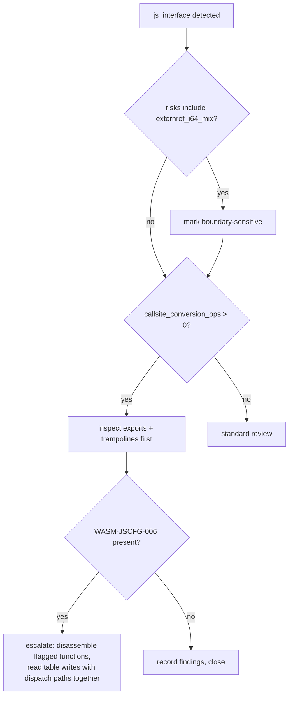

# Lesson 4: JS-facing modules and boundary risk

Most WebAssembly in the wild runs next to JavaScript. The module cannot touch the DOM, the console, or a JS object without crossing the JS/Wasm boundary, and that boundary is where interop complexity and bug classes concentrate. This lesson shows how to detect a JS-facing module, read its boundary inventory, and decide where to spend your manual review time.

## The sample

`tests/fixtures/js_interface.wasm` is a wasm-bindgen-style module:

```bash
wasm-tools tests/fixtures/js_interface.wasm --json | jq '{imports: [.imports[] | .module + "::" + .name], exports: [.exports[].name]}'
```

```json
{
  "imports": [
    "js::console_log",
    "wbg::__wbindgen_throw",
    "wasm:js-string::length"
  ],
  "exports": ["run", "__wbindgen_start"]
}
```

Three namespaces, three stories. `js::console_log` is a direct call into the JS host. `wbg::__wbindgen_throw` is wasm-bindgen ABI glue that turns Rust panics into JS exceptions. `wasm:js-string::length` is a normative JS builtin: the module calls the engine's own string length operation without copying the string into linear memory. On the export side, `run` is the application entry and `__wbindgen_start` runs automatically at instantiation.

The detection block summarizes all of it:

```bash
wasm-tools tests/fixtures/js_interface.wasm --json --analysis-only | jq '.detections.js_interface | {detected, confidence, signals, builtin_sets}'
```

```json
{
  "detected": true,
  "confidence": "high",
  "signals": [
    "js_namespace_import",
    "wasm_builtin_namespace_import",
    "wbindgen_pattern"
  ],
  "builtin_sets": ["js-string"]
}
```

Confidence is `high` because namespace imports are unambiguous. Name-pattern-only signals (`wbindgen_pattern` alone, `emscripten_pattern`) produce `medium`, and export-name-only evidence produces `low`.

## The boundary inventory

Signature surface is where the interesting risk lives. Every import and export signature crosses the boundary, and certain shapes are harder to translate correctly than others. `tests/fixtures/js_deopt_surface.wasm` is built to exercise them:

```bash
wasm-tools tests/fixtures/js_deopt_surface.wasm --json | jq '.analysis.detections.js_interface.signature_surface | {boundary_count, risky_boundary_count, risks}'
```

```json
{
  "boundary_count": 7,
  "risky_boundary_count": 2,
  "risks": ["externref_i64_mix", "multi_result_boundary", "ref_numeric_mix"]
}
```

What the risk tokens mean:

- `externref_i64_mix`: some boundaries carry tagged references (`externref`) and others carry 64-bit integers (`i64`). Mixing them means the glue has to materialize return values correctly per type, and mismatches are a real bug class.
- `multi_result_boundary`: at least one boundary returns multiple values, which JS glue must unpack.
- `ref_numeric_mix`: references and numerics share signatures, raising translation complexity.

The individual offenders are listed with reasons:

```bash
wasm-tools tests/fixtures/js_deopt_surface.wasm --json | jq '.analysis.detections.js_interface.risky_import_signatures'
```

```json
[
  {
    "module": "js",
    "name": "pair",
    "type_index": 2,
    "params": [],
    "results": ["i32", "i64"],
    "reasons": ["multi_result_boundary"]
  },
  {
    "module": "js",
    "name": "to_i64",
    "type_index": 3,
    "params": ["externref"],
    "results": ["i64"],
    "reasons": ["externref_i64_mix", "ref_numeric_mix"]
  }
]
```

`to_i64` takes an opaque JS reference and returns a 64-bit integer: a decompression-style helper whose correctness depends entirely on the glue. That is the kind of function to read by hand.

## Trampolines and conversion pressure

Two more signals rank the glue:

```bash
wasm-tools tests/fixtures/js_deopt_surface.wasm --json | jq '{
  trampolines: .analysis.detections.js_interface.entry_trampolines,
  conversion_ops: .analysis.profiles.control_flow.callsite_conversion_ops
}'
```

```json
{
  "trampolines": {
    "detected": true,
    "count": 1,
    "functions": [
      {
        "index": 6,
        "name": "",
        "instruction_count": 10,
        "risk_ops": ["i32.wrap_i64", "table.set"]
      }
    ]
  },
  "conversion_ops": 1
}
```

`entry_trampolines` flags functions that look like glue entry points and records the risky operations inside them. Function 6 contains both `i32.wrap_i64` (collapsing a 64-bit value across the boundary) and `table.set` (mutating a dispatch table), two signals in one small function. `callsite_conversion_ops` counts conversion and cast operations in the short window before calls: 0 is simple, 1 to 3 is moderate, and 4 or more usually means conversion-heavy wrappers.

## When the patterns combine into a finding

`WASM-JSCFG-006` fires when JS exposure, dynamic dispatch, and mutable tables overlap in JS-reachable code paths:

```bash
wasm-tools tests/fixtures/js_deopt_surface.wasm --json | jq '.analysis.findings[] | select(.id == "WASM-JSCFG-006")'
```

```json
{
  "id": "WASM-JSCFG-006",
  "title": "JS-exposed entrypoints combine dynamic dispatch and mutable table operations",
  "severity": "high",
  "confidence": "medium",
  "evidence": {
    "indirect_call_ops": 2,
    "table_mutation_ops": 1,
    "js_exposed_dynamic_funcs": [6, 7],
    "js_exposed_table_mutation_funcs": [6],
    "paths_from_export": [[6], [7]]
  },
  "remediation": "Reduce mutable table writes in exported/JS-facing entrypoints and isolate dynamic dispatch behind strict validation."
}
```

`paths_from_export` is the escalation trigger: it shows that exported code reaches the dispatching and mutating functions. A mutable table written from JS-reachable code is the WebAssembly equivalent of a writable function pointer table next to an entry point.

## The 60 to 90 second triage flow



One command pulls all three signals for this flow:

```bash
wasm-tools module.wasm --json | jq '{
  risks: .analysis.detections.js_interface.signature_surface.risks,
  conversion_ops: .analysis.profiles.control_flow.callsite_conversion_ops,
  jscfg: first([.analysis.findings[]? | select(.id == "WASM-JSCFG-006")])
}'
```

## Reading the flagged functions

Finish the lesson by looking at what the heuristics pointed at:

```bash
wasm-tools tests/fixtures/js_deopt_surface.wasm -d | sed -n '/func\[6\]/,/^$/p'
```

You should find the `table.set` and the `call_indirect` or `call_ref` in the same small body, which is the whole story the finding tried to tell. These are static heuristics: they identify modules that are more likely to contain fragile boundary glue. They do not confirm exploitability. The confirmation step is always the disassembly, and now you know exactly which functions to open first.
