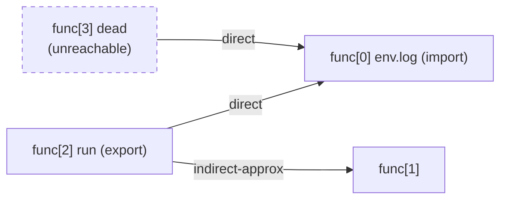

# Lesson 6: The static call graph

A module is a graph: functions calling functions, functions calling imports, exports pointing inward. The report's `call_graph` block hands you that graph with labeled edges and a reachability map. This lesson builds intuition for the edge labels, because two of the three kinds are honest approximations, and knowing what each label promises is the difference between a correct conclusion and a wrong one.

## The sample

`tests/fixtures/call_graph.wasm` has four nodes: one import, two local functions, one export, and one deliberate dead function. Here is the whole module in `.wat` form:

```wat
(module
  (import "env" "log" (func $log (param i32)))
  (type $helper_t (func (param i32) (result i32)))
  (table 2 funcref)
  (elem (i32.const 0) $helper)
  (func $helper (param i32) (result i32)
    local.get 0)
  (func $run (export "run")
    i32.const 7
    call $log
    i32.const 1
    i32.const 0
    call_indirect (type $helper_t)
    drop)
  (func $dead
    i32.const 99
    call $log)
)
```

The graph in JSON:

```bash
wasm-tools tests/fixtures/call_graph.wasm --json | jq '.call_graph | {node_count, edge_count, nodes, edges}'
```

```json
{
  "node_count": 4,
  "edge_count": 3,
  "nodes": [
    {
      "index": 0,
      "name": "env.log",
      "imported": true,
      "exported": false,
      "module": "env",
      "import_name": "log"
    },
    { "index": 1, "name": "", "imported": false, "exported": false },
    { "index": 2, "name": "run", "imported": false, "exported": true },
    { "index": 3, "name": "", "imported": false, "exported": false }
  ],
  "edges": [
    { "from": 2, "to": 0, "kind": "direct", "offset": 78 },
    { "from": 2, "to": 1, "kind": "indirect-approx", "offset": 84 },
    { "from": 3, "to": 0, "kind": "direct", "offset": 94 }
  ]
}
```

The same graph, drawn:



Three edge kinds appear across the tool's output:

| Kind              | How it is derived                                      | How to read it                                                                                     |
| ----------------- | ------------------------------------------------------ | -------------------------------------------------------------------------------------------------- |
| `direct`          | A `call` instruction with a resolved index             | Certain: this call invokes this target today.                                                      |
| `indirect-approx` | Element segments seeding tables                        | Possible: the table entry holds this target now, but `table.set` or runtime indices can change it. |
| `typed-approx`    | Signature type matching where no table evidence exists | Speculative: some function with this signature may be the target.                                  |

The offset on each edge is the file position of the call instruction, which takes you straight to the disassembly line when you need to see the call in context.

## Node names come from two sources

Notice that node 2 has the name `run` even though the fixture has no `name` custom section: exported functions get their export names. Node 1 is anonymous because nothing names it. If the module carried a `name` custom section, `functions[].name` would populate for all locals and the graph nodes would show those names too. Stripped binaries produce mostly anonymous nodes; the `--calls` selector still accepts indices, and export names still resolve.

## Import xrefs

`import_xrefs` flips the question from "who does this function call?" to "who calls this import?":

```bash
wasm-tools tests/fixtures/call_graph.wasm --json | jq '.call_graph.import_xrefs'
```

```json
[
  {
    "func": 0,
    "name": "env.log",
    "module": "env",
    "import_name": "log",
    "call_count": 2,
    "callers": [
      { "index": 2, "name": "", "offset": 78 },
      { "index": 3, "name": "", "offset": 94 }
    ]
  }
]
```

The `env.log` import is called twice, from `run` and from `dead`. On real modules this block is the fastest route from "this import is dangerous" to "these are the functions that use it dangerously".

## Reachability

```bash
wasm-tools tests/fixtures/call_graph.wasm --json | jq '.call_graph.reachability'
```

```json
{
  "roots": [2],
  "reachable_functions": [0, 1, 2],
  "reachable_count": 3,
  "unreachable_functions": [3],
  "unreachable_count": 1
}
```

Roots are exports (and the start function, when present). From `run`, the tool reaches the import and the approximate target, giving functions 0, 1, and 2. Function 3 (`dead`) is unreachable: nothing exported or started can arrive at it. In review terms, `unreachable_functions` is dead code. It still costs binary size and it still matters if a future export reaches it, but it cannot execute in the artifact as shipped.

Approximation caveats apply to reachability too: because indirect edges are over-approximations, reachability is an over-approximation. The safe direction to be wrong in: real reachable code is never under-reported, but listed reachability may not fire at runtime.

## Call trees from the CLI

The `--calls` flag prints the outgoing tree for one function:

```bash
wasm-tools tests/fixtures/call_graph.wasm --calls run
```

```text

Call tree for func[2] <run> [export]:

  -> func[0] <env.log> [import] (direct @0x4e)
  -> func[1] (indirect-approx @0x54)
```

The marker annotations are deterministic: `(recursion)` marks a node on the current path, `(seen)` marks a node already expanded, and `...` marks a subtree cut at the depth cap of 4. Selecting by index works when names do not:

```bash
wasm-tools tests/fixtures/call_graph.wasm --calls 3
```

```text

Call tree for func[3]:

  -> func[0] <env.log> [import] (direct @0x5e)
```

The dead function still calls `log`; unreachability does not mean its body is empty, it means nothing can invoke it.

## Using the graph in triage

The graph earns its keep on modules too large to read. A practical sequence for a real binary:

```bash
# 1. Which dangerous imports exist, and who calls them?
jq '[.call_graph.import_xrefs[] | select(.name | test("sock|path_open|exec")) | {name, call_count}]' report.json

# 2. What is actually reachable from the outside?
jq '.call_graph.reachability | {reachable_count, unreachable_count}' report.json

# 3. Walk from each export into the interesting subtrees.
wasm-tools module.wasm --calls run
```

Remember the direction of the errors: a `direct` edge is a fact, an approximate edge is a candidate, and reachability built on candidates is a ceiling. When a finding cites `paths_from_export` (see [WASM-JSCFG-006](FINDINGS.md)), those paths deserve manual confirmation in the disassembly, which is exactly what [lesson 4](LESSON4.md) demonstrates.
