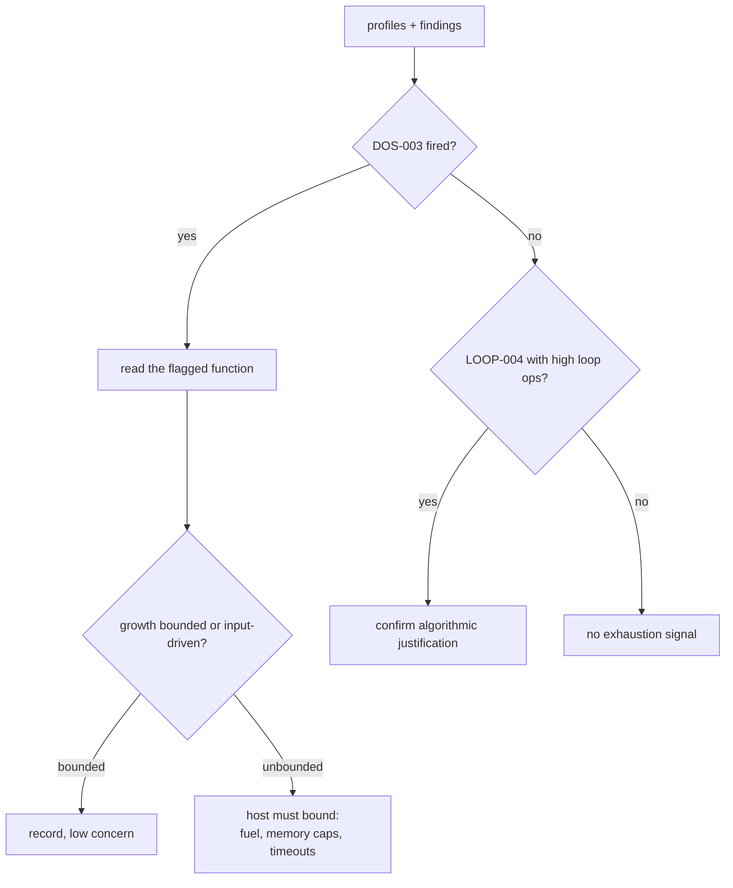

# Lesson 7: Resource exhaustion patterns

Not every malicious module steals data. Some just consume: memory that never stops growing, loops nested deep enough to burn CPU for minutes per call. Denial-of-service patterns are attractive in WebAssembly because modules run inside hosts that share resources with everything else, from a browser tab to a plugin host serving thousands of requests. This lesson reads the exhaustion signals the tool computes and decides when they matter.

## The sample

`tests/fixtures/dos_growth_loop.wasm` is a tiny module with a loop that grows memory:

```bash
wasm-tools tests/fixtures/dos_growth_loop.wasm --json --analysis-only | jq '{summary, profiles: {memory: .profiles.memory, compute: .profiles.compute}, findings}'
```

```json
{
  "summary": { "risk_score": 30, "risk_tier": "low", "finding_count": 1 },
  "profiles": {
    "memory": {
      "memory_access_ops": 1,
      "memory_grow_ops": 1,
      "bulk_memory_ops": 0,
      "data_segment_total_bytes": 0
    },
    "compute": {
      "max_loop_depth": 1,
      "loop_memory_ops": 1,
      "loop_branch_ops": 1
    }
  },
  "findings": [
    {
      "id": "WASM-DOS-003",
      "title": "Memory growth occurs in loop context",
      "severity": "high",
      "confidence": "medium",
      "evidence": {
        "memory_grow_ops": 1,
        "loop_memory_ops": 1,
        "functions": [0]
      },
      "remediation": "Apply growth limits and add explicit loop bounds when executing untrusted inputs."
    }
  ]
}
```

The rule behind it: `WASM-DOS-003` fires when a `memory.grow` executes inside a loop body. A one-time startup growth is unremarkable even when other code touches memory in loops (nearly every compiled program does); what matters is growth driven by iteration. The evidence names the offending function, so you know exactly where to look:

```bash
wasm-tools tests/fixtures/dos_growth_loop.wasm -d
```

Note the export in this fixture is named `grow_loop`, and the module computes with no imports at all. That is the point: exhaustion needs no host capabilities. The [WASI triage](LESSON3.md) capabilities list is empty here, yet the module can still take down a host that lets it run unbounded.

## The counter groups

Three profile groups feed the exhaustion rules, documented field by field in [findings and signals](FINDINGS.md). The ones to watch:

| Signal                               | Where              | Exhaustion meaning                                                                              |
| ------------------------------------ | ------------------ | ----------------------------------------------------------------------------------------------- |
| `memory_grow_ops`                    | `profiles.memory`  | Each grow request expands the sandbox; repeated grows inside loops are the classic OOM pattern. |
| `max_loop_depth`                     | `profiles.compute` | Depth 3 or more triggers `WASM-LOOP-004`; nesting multiplies per-call work.                     |
| `loop_memory_ops`, `loop_branch_ops` | `profiles.compute` | Work performed per iteration; high values amplify any unbounded loop.                           |
| `bulk_memory_ops`                    | `profiles.memory`  | `memory.copy` and `memory.fill` move large regions cheaply, which cuts both ways.               |

`WASM-LOOP-004` needs deeper nesting than any shipped fixture has, so later in this lesson we build one and watch it fire at depth 3.

## From finding to judgment

The exhaustion question has two halves: does the code amplify, and does the host bound it? The tool answers the first half. For the second half, check what an export can reach and whether inputs can drive the loop counts:

```bash
wasm-tools tests/fixtures/dos_growth_loop.wasm --json | jq '.call_graph.reachability'
wasm-tools tests/fixtures/dos_growth_loop.wasm --calls grow_loop
```

Then read the flagged function. The remediation line in the finding is runtime-side advice, and it is worth taking seriously in your own deployments: fuel metering (Wasmtime), memory limits, and watchdog timeouts are the standard defenses, and none of them require changing the module.



## Building your own test modules

The fixture is one `memory.grow` inside one loop. To see the counters respond to shape rather than size, hand-write variants. The growth module needs no imports, just a memory declaration, a function, and the growth instruction inside a `loop`:

```wat
(module
  (memory 1)
  (func (export "grow_loop")
    (loop $l
      (memory.grow (i32.const 1))
      drop
      br $l)))
```

Compile it with `wat2wasm` (from WABT) and run the analysis-only command above. The finding reproduces with identical evidence: `memory_grow_ops` 1, `loop_memory_ops` 1, function 0.

The depth rule is just as easy to trigger. Three nested loops, no memory ops at all:

```wat
(module
  (memory 1)
  (func (export "nested")
    (loop $a
      (loop $b
        (loop $c
          br $c)))))
```

```bash
wat2wasm nested.wat -o nested.wasm
wasm-tools nested.wasm --json | jq '[.analysis.findings[] | {id, severity, evidence}]'
```

```json
[
  {
    "id": "WASM-LOOP-004",
    "severity": "medium",
    "evidence": { "max_loop_depth": 3 }
  }
]
```

Remember the base rates before you raise the alarm on real code. Compression, hashing, image processing, and parsing all produce deep loops and heavy memory traffic legitimately. The profiles measure shape, not intent; the smallest demonstrations in this section are also the clearest argument for runtime bounding rather than static bans.

## Relationship to the risk score

The score buckets exhaustion evidence modestly on this fixture (score 30, tier low) while the finding itself is severity high. That asymmetry is intentional: the score is capability-weighted, and this module imports nothing. Read score and findings as separate axes, as the [JSON reference](JSON_REFERENCE.md) notes, and let the finding drive the review queue.
